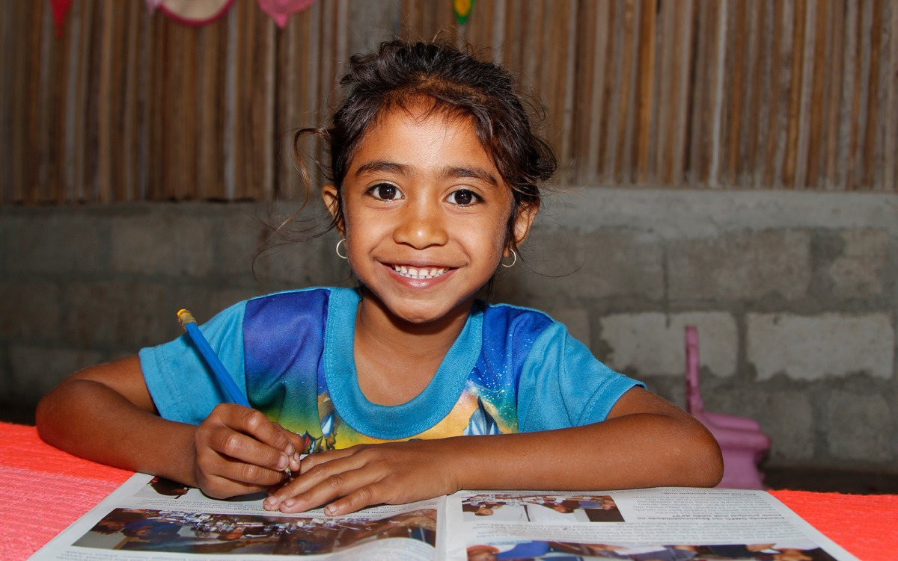
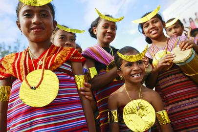
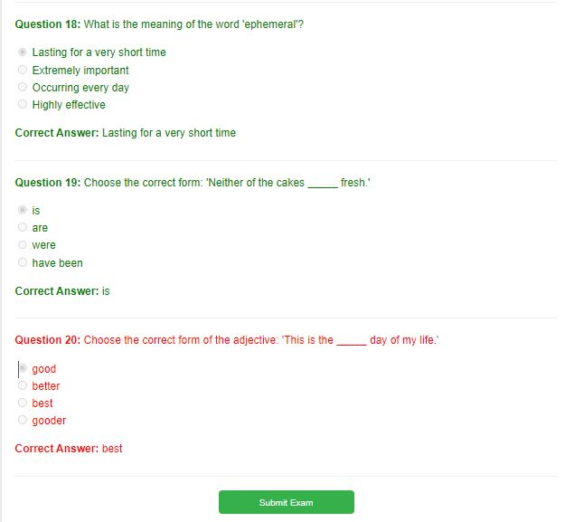
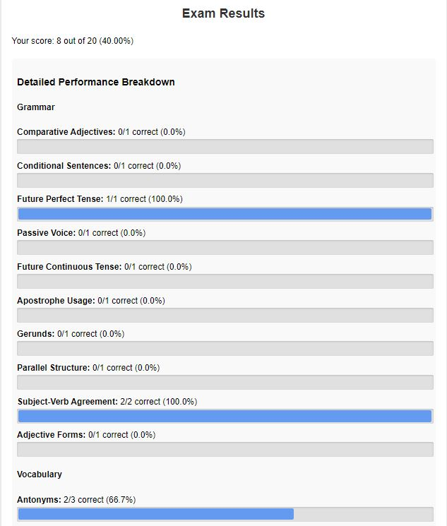
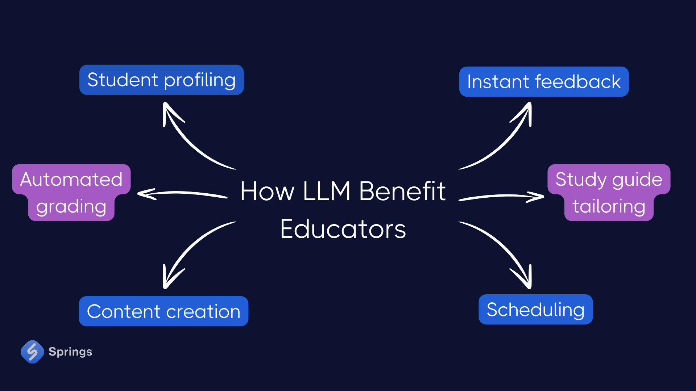
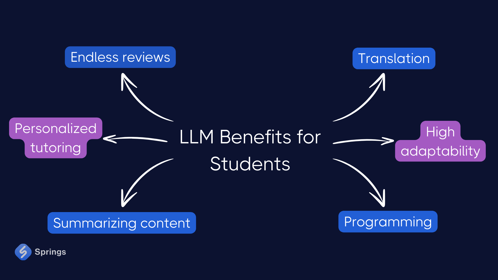
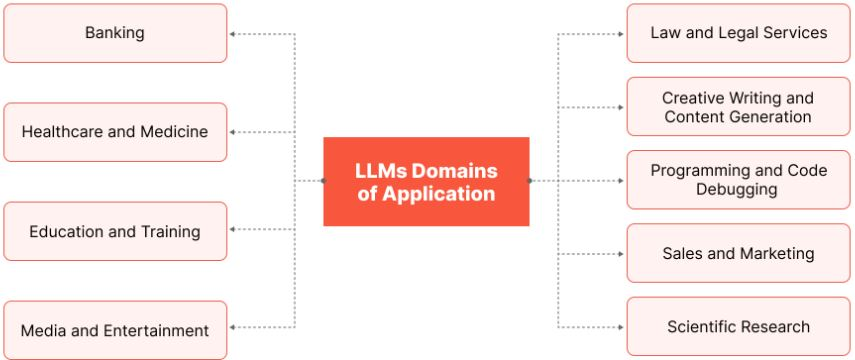
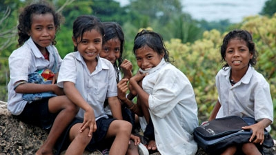

# Haforsa Timor-Leste: viajen aprendizajen kolaborativu ida / Empowering Timor-Leste: A Collaborative Learning Journey

Welcome to this comprehensive resource hub designed to support Peace Corps volunteers and the vibrant communities of Timor-Leste. This collection of materials aims to foster sustainable development, cultural exchange, and mutual learning between volunteers and Timorese people.

## Média / Media



Bele hetan média apoiu ba kursu sira iha ne'e/Support media for the courses can be found here:
https://tefl.go-tl.com/

## Matadalan ba navigasaun / Navigation Guide

To make the most of these resources:

1. Begin with the syllabus in the **syllabus/** directory to understand course objectives.
2. Explore related readings in the **Readings/** folder for in-depth knowledge.
3. Follow structured lesson plans in the **lesson_plans/** directory.
4. Engage with hands-on activities from the **activities/** folder and assess understanding through quizzes in the **quizzes/** directory.

For practical application:
- Utilize tools and demonstrations in the **scripts/** directory.
- Enjoy interactive learning experiences in the **games/** folder.
- Discover traditional and medicinal preparations in the **recipes/** section.


## Translation from Tetum to English and Vice Versa

An aws lambda/python service that uses an llm to augment a dictionary based translation system;
https://go-tl.com/translate

https://github.com/ddtraveller/TEFLTools/blob/main/scripts/translate/lambda_function.py

A simplistic translation service in html and javascript that uses the same dictionary;

https://content.go-tl.com/translate.html

https://github.com/ddtraveller/TEFLTools/blob/main/scripts/translate.html

The code uses this dictionary which is easily updateable. 
https://github.com/ddtraveller/TEFLTools/blob/main/scripts/dictionary.js

This is a python implementation that runs locally;
https://github.com/ddtraveller/TEFLTools/blob/main/scripts/translate_to_Tetum.py

## Kursu Prinsipal sira / Key Courses

Repo ida-ne'e iha kursu individuál 100 resin no arkivu 5000+ ho informasaun kursu ne'ebé rejionalizadu ba Timor Leste ho fokus ba empoderamentu feto. / 
This repo contains over 100 individual courses and 5000+ files with course information that is regionalized for Timor Leste and with a focus on female empowerment.

Kursu hotu-hotu rejionalizadu ba Timor-Leste no inkluzivu ba matenek lokál aliña ho peskiza modernu no prátika di'ak sira, kria esperiénsia aprendizajen úniku ida-ne'ebé respeita kultura lokál no introdús abilidade foun sira.

All courses are regionalized for Timor Leste and inclusive of local wisdom aligned with modern research and best practices, creating a unique learning experience that respects local culture while introducing new skills:

1. **Moris rejenerativu: Aprosimasaun Permakultura / Regenerative Living: A Permaculture Approach**
   - Learn sustainable permaculture, agricultural and husbandry techniques tailored to Timor-Leste's unique ecology.

2. **Holistiku Kura Arte no Pratika / Holistic Healing Arts and Practices**  
   - Explore traditional Timorese healing methods alongside modern holistic approaches.

3. **Prátika Ingles ba Timor-Leste / Practical English for Timor-Leste**
   - Develop English skills contextualized for daily life and work in Timor-Leste.

4. **Inovasaun no Sustentabilidade Ai-han ba Timor-Leste / Food Innovation and Sustainability for Timor-Leste**
   - Discover ways to enhance food security using local ingredients and sustainable methods.

5. **Konstrusaun Bambu Sustentavel iha Timor-Leste / Sustainable Bamboo Construction in Timor-Leste**
   - Learn eco-friendly building techniques using locally abundant bamboo.

6. **Dezenvolvimentu no Implementasaun permajardín ba Seguransa Ai-han iha Timor-Leste / Permagarden Design and Implementation for Food Security in Timor-Leste**
   - Create productive, sustainable gardens to support community nutrition.

7. **Dezenvolvimentu software ba Timor-Leste / Software Development for Timor-Leste**
   - Learn the tools and fundamental skills necessary to work in the software development industry as an independent contractor.

8. **Introdusaun ba Programa Python ba Timor-Leste / Introduction to Python Programming for Timor-Leste**
   - Gain practical coding skills to drive technological innovation in Timor-Leste.

9. **Introdusaun ba Herbalizmu Mediku ba Timor-Leste / Introduction to Medical Herbalism for Timor-Leste**
   - Gain knowledge of the science of plants, their parts and how they work in the body along with information on local plants and herbs that make up part of a healthy diet or have practical uses.

10. **Sustentavel Dezenvolvimentu Lokal no Arkitekultura / Sustainable Local Development and Architecture**
    - Based on renowned architect Ana Heringer's work Simply Local, learn about sustainable, local building practices.

11. **Tempu Banku / Time Banking**
    - This course explores time banking as an innovative approach to community development and alternative economics in the context of Timor-Leste. Students will learn about the historical and philosophical foundations of time banking, examine how time bank systems operate in practice, and analyze their potential impacts on individuals and communities. Through case studies, practical implementation guidance, and community engagement, students will gain a comprehensive understanding of time banking as a tool for social change and economic empowerment in Timor-Leste.

12. **Ekonomia Dezenvolvimentu / Developmental Economics**
    - This course explores an experimental approach pioneered by Abhijit Banerjee and Esther Duflo to development economics, and its application to poverty alleviation. Students will learn about innovative research methods, key findings in education, health, behavioral economics, gender, politics, and credit, and how these insights can be applied to Timor-Leste's unique context.

13. **Teoria Polivagal / Polyvagal Theory**
    - This course will teach the hierarchy of neural channels, the autonomic nervous system, neuroception, and how these concepts relate to social engagement, stress responses, and trauma recovery.

14. **Edukasaun Saude Seksual / Sexual Health Education**
    - This course aims to provide culturally appropriate sexual health and relationships education for young adults in Timor-Leste. 
    - Increase understanding of human sexuality, reproductive health, and healthy relationships
    - Promote safe sexual practices and reduce rates of sexually transmitted infections and unintended pregnancies
    - Encourage gender equality and respect in relationships
    - Provide accurate information to counter myths and misinformation
    - Empower participants to make informed decisions about their sexual and reproductive health
    
15. **Maromak nia feminina / The Divine Feminine**
    - This course explores the history of human sexuality and the divine feminine, with a focus on Timorese cultural context. Students will examine how concepts of gender, sexuality, and spirituality have evolved over time and how they manifest in Timor-Leste today.

16. **Empoderamentu no Lideransa Feto iha Timor-Leste / Women's Empowerment and Leadership in Timor-Leste**
    - This course aims to empower women in Timor-Leste to become effective leaders and agents of change in their communities. Participants will develop leadership skills, understand gender equality concepts, and learn strategies to overcome cultural barriers. The course will emphasize practical application and community engagement, considering Timor-Leste's unique cultural context.

17. **Neurosciensia no Sosiedade iha Timor Leste / Neuroscience and Society in Timor Leste**
    - This course explores the intersection of neuroscience, philosophy, and society, with a focus on applying these concepts to the cultural context of Timor-Leste. Students will examine how brain structure and function influence human behavior, decision-making, and social dynamics. The course aims to develop critical thinking skills and encourage students to consider the ethical implications of neuroscientific advances in Timorese society.

18. **Intro ba Biology Marine / Intro to Marine Biology**
    - This course aims to introduce students to marine biology and conservation principles, with a specific focus on the unique marine ecosystems of Timor-Leste. Students will gain an understanding of marine biodiversity, ecosystem functions, and conservation challenges in the local context. The course emphasizes the importance of sustainable practices and community engagement in protecting Timor-Leste's marine resources.

19. **Aramaiku Jesus no Timor Leste / Aramaic Jesus and Timor Leste**
    - This course explores the native tongue of Jesus, Aramaic, its use in his teachings and its relevance to Timor-Leste's cultural and spiritual context.

20. **Mikrobioma /The Microbiome**
    - This course explores the human microbiome and its impact on health, with a focus on applications in Timor-Leste. Students will learn about the diverse microbial communities inhabiting the human body, their roles in health and disease, and how environmental and cultural factors in Timor-Leste influence the microbiome. The course aims to provide a foundation for understanding microbiome research and its potential applications in improving public health in Timor-Leste.

21. **Teknika Propagasaun Planta avansadu ba Timor Leste / Advanced Plant Propagation Techniques for Timor Leste**
    - This course covers advanced techniques for propagating and improving plants native to Timor Leste, with a focus on grafting, cloning, and selective breeding. Students will learn both the scientific principles and practical applications of these methods for horticulture, agroforestry, and ecological restoration. The content spans from basic grafting procedures to complex propagation strategies, providing a comprehensive look at how these techniques are used to cultivate desired plant traits and optimize crop production in Timor Leste's unique climate and ecosystems.

22. **Kafé no Genetika / Coffee Breeding and Genetics**
    - The program focuses on sustainable farming practices, disease management, post-harvest processing, and quality control tailored to the unique environmental and cultural context of Timor-Leste.

23. **Serbisu partu no doutór / Doulas and Birthing Work**
    - Learn about how doulas provide emotional, physical, and informational support to women during pregnancy, childbirth, and the early postpartum period.

24. **Tratamentu kona-ba kraniozakral / Craniosacral Therapy**
    - This course introduces the fundamentals of craniosacral therapy, adapted for the cultural context of Timor-Leste. Students will about learn basic anatomy, physiology, and about hands-on techniques to assess and treat the craniosacral system.

25. **Drenajen lymfatiku / Lymphatic Drainage**
    - This course aims to introduce students in Timor-Leste to the principles and techniques of Manual Lymphatic Drainage (MLD). Participants will learn about the lymphatic system, its importance in health, and about how practitioners perform MLD techniques adapted for the Timorese context.

26. **Introdusaun ba Chi Gung / Introduction to Chi Gung**
    - This course introduces the practice of Qigong to promote health and wellness in Timor-Leste. Students will learn fundamental Qigong principles and techniques adapted to the local cultural context. Basic Qigong movements and breathing exercises, and the connections between Qigong and traditional Timorese healing practices will be discussed

27. **Introdusaun ba Nei Gung / Introduction to Nei Gung**
     - Nei Gong, an ancient Chinese practice rooted in Daoist traditions, offers a path to cultivating internal energy and achieving harmony between mind, body, and spirit. This internal energy cultivation technique has gained increasing attention in the West as people seek holistic approaches to health and personal development. 
 
28. **Miranda MacPherson**
    - This course aims to introduce participants in Timor-Leste to the practice of ego relaxation and the transformative power of grace. Drawing from Miranda Macpherson's teachings, the course will adapt concepts to the Timorese cultural context, integrating local spiritual traditions and addressing specific challenges faced by the community.

29. **Sistema cooling pasivu no ho enerjia ki'ik ba edifísiu iha Timor Leste / Passive and Low-Energy Cooling Systems for Buildings in Timor Leste**
    - This course aims to introduce participants to spiritual development practices while respecting Timorese cultural traditions based on the teachings of Tibetan meditation master Chogyam Trungpa.

30. **Intelligence emosionál / Emotional Intelligence**    
    - This course aims to introduce participants to the concepts of emotional intelligence and trauma-informed care, with a specific focus on their application in Timor-Leste. Participants will learn about the impact of trauma on emotional development, strategies for building emotional resilience, and culturally appropriate interventions for supporting individuals and communities affected by trauma.
    
31. **Kultivasaun Moris ho laran tomak iha Timor-Leste / Cultivating Wholehearted Living in Timor-Leste**
    - This course aims to introduce participants in Timor-Leste to the concepts of Wholehearted living, focusing on cultivating courage, compassion, and connection. Participants will explore how to embrace their authentic selves, develop resilience, and foster meaningful relationships within their communities. The course will adapt Brené Brown's research on vulnerability and shame to the Timorese cultural context, emphasizing local values and traditions while addressing universal human experiences.

32. **Karoline Myss: Arketype iha Psikolojia no Kultura Timor-Leste / Caroline Myss: Archetypes in Timorese Psychology and Culture**   
    - This course explores the concept of archetypes as fundamental patterns of human behavior and consciousness within the context of Timorese culture. Drawing from various cultural, psychological, and spiritual traditions, it examines how archetypes influence personal development, societal structures, and creative expression in Timor-Leste. The course emphasizes the universal nature of archetypes while considering their diverse manifestations across different Timorese contexts. Students will learn to identify archetypal patterns in Timorese folklore, literature, and daily life, and understand how these patterns shape individual and collective identity.

33. **Violénsia iha Timor Leste / Violence in Timor Leste** 
    - This course examines the complex security challenges facing Timor-Leste in its post-conflict transition, with a focus on small arms control, armed group violence, and efforts to reform the security sector. Students will analyze the interplay between weapons proliferation, socioeconomic factors, and weak institutions in fueling ongoing instability. The course critically assesses government and civil society interventions aimed at reducing armed violence and building sustainable peace.

34. **Salina Agrikultura ba Timor-Leste / Saline Agriculture for Timor-Leste**
    - This course aims to introduce saline agriculture techniques and salt-tolerant crops to farmers and agricultural students in Timor-Leste. The goal is to expand agricultural production in coastal and saline-affected areas, improving food security and economic opportunities. By the end of this course, participants will be able to:
    - Understand the principles of saline agriculture
    - Identify salt-tolerant crops suitable for Timor-Leste's climate and conditions
    - Apply techniques for managing saline soils and irrigation
    - Develop plans for implementing saline agriculture projects in their communities
    - 
35. **Sinerjetiku / Synergetics**    
    - This course introduces students to Buckminster Fuller's comprehensive approach to global problem-solving, with a focus on applying these principles to challenges in Timor-Leste. Students will explore synergetics, design science, and systems thinking to develop innovative solutions for local and national issues. The course aims to foster critical thinking, creativity, and a holistic understanding of interconnected systems.

36. **Axis Brain-Gut-Microbiota: Nutrisaun, Saude Mental, no Neuroplastiku iha Timor-Leste nia laran / The Brain-Gut-Microbiota Axis: Nutrition, Mental Health, and Neuroplasticity Across the Lifespan in Timor-Leste**    
    - This course explores the intricate relationship between nutrition, gut microbiota, and mental health across the human lifespan, with a focus on the Timorese context. Students will examine how dietary choices influence brain function, neuroplasticity, and the development of mental health disorders through the brain-gut-microbiota axis. The course emphasizes the importance of understanding these connections for developing effective interventions and promoting overall brain health and well-being in Timor-Leste.

37. **Mestre Enerjia Moris / Masters of the Living Energy**
    - This course explores the mystical traditions and shamanic practices of the Andean Q'ero people, adapting these concepts to the cultural context of Timor-Leste. Students will learn about energy work, shamanic initiations, and indigenous wisdom while drawing parallels to Timorese spiritual traditions. The course aims to bridge indigenous and modern worldviews, fostering personal transformation through adapted Andean spiritual techniques.

38. **Terapia Red Light / Red Light Therapy**
    - This course explores the scientific principles and practical applications of red and near-infrared light therapy, tailored for the context of Timor-Leste. Students will learn about the biological effects of specific light wavelengths on cellular function, optimal dosing strategies, and the potential health benefits relevant to the Timorese population. The course emphasizes proper device selection, treatment protocols, and safety considerations while addressing local health challenges and cultural practices.

39. **Yoga Vasishta Sara**
    - This course explores the profound spiritual and philosophical teachings of the Yoga Vasishta, adapting its timeless wisdom to the cultural context of Timor Leste. Students will examine non-dualistic philosophy, the nature of consciousness and reality, and practical methods for self-inquiry and self-realization. The course aims to provide students with a deep understanding of Yoga Vasishta's teachings and their relevance to contemporary life in Timor Leste, fostering personal growth and spiritual development.

40. **Medisina tradisionál Xina nian / TCM**
    - This course explores holistic approaches to pain management through the lens of Traditional Chinese Medicine (TCM), adapted for the cultural context of Timor-Leste. Students will learn fundamental TCM concepts, various treatment modalities, and self-care practices that address pain by promoting overall balance and wellness in the body, mind, and spirit. The course emphasizes personalized approaches based on individual needs and constitution types, integrating ancient wisdom with modern understanding of health and pain management while respecting local Timorese healing traditions.

41. **Rendimentu Baziku Universal / Universal Basic Income**
    - This course examines the concept of Universal Basic Income (UBI) from an economic and policy perspective, with a focus on its potential application in Timor-Leste. Students will explore the role of UBI in addressing income inequality, poverty, and gaps in existing social safety nets within the Timorese context. The course compares UBI to current transfer programs, analyzes its potential distributional and fiscal impacts, and evaluates its effects on labor markets and social welfare in Timor-Leste.

42. **Orasaun nia laran / The Heart of Prayer**
    - This course, based on Rupert Spira's book of the same name, explores the fundamental nature of being, consciousness, and divinity through the lens of prayer and meditation, with a focus on Timorese cultural and spiritual traditions. Students will examine teachings from various spiritual traditions, including Catholicism and indigenous Timorese beliefs, to understand the relationship between individual existence and infinite being. The course emphasizes practical approaches to realizing one's true nature and experiencing unity with the divine within the context of Timorese society.
    
43. **Lian, Edukasaun no Dezenvolvimentu Nasional iha Sosiedade Multilingual: Perspetiva Timor-Leste / Language, Education and National Development in Multilingual Societies: A Timor-Leste Perspective**
    - From Kristy Sword Gusmao's work, this course examines the complex relationships between language, education, and national development in multilingual societies, with a focus on Timor-Leste as a case study. Students will explore challenges and strategies for implementing mother tongue-based multilingual education, the role of school facilities and resources in supporting student learning, and approaches to preserving linguistic and cultural diversity while promoting national unity through education policy. 

44. **Sistema Administrasaun no Komandu Lina Fundamental / Linux System Administration and Command Line Fundamentals**
    - This course provides a comprehensive introduction to Linux operating systems, focusing on core concepts, command line skills, and system administration fundamentals. Students will learn about the Linux kernel, user space, and key system components while developing practical skills in navigating the file system, managing processes and users, and performing essential administrative tasks. The course emphasizes hands-on experience with common utilities and shell scripting to prepare students for real-world Linux environments in Timor Leste.    

45. **Fundamentals of Computer Networking and Internet Technologies for Timor-Leste / Fundamentals of Computer Networking and Internet Technologies for Timor-Leste**
    - This course provides a comprehensive introduction to computer networking concepts tailored for students in Timor-Leste. It covers both local and wide area networks, exploring the layered architecture of networks, various networking technologies, and the protocols that enable communication between devices. The course also delves into Internet technologies, addressing schemes, and basic network security principles, providing students with a solid foundation in modern networking practices relevant to Timor-Leste's developing technological landscape.

46. **Kualidade Kuidadu Labarik no Asesu iha Rural no Urbanu Timor-Leste. / Child Care Quality and Access in Rural and Urban Timor-Leste**
    - This course examines differences in child care quality, availability, and affordability between rural and urban areas of Timor-Leste, with a focus on structural quality indicators like child-to-adult ratios. It explores how factors such as child care subsidies, costs, and family characteristics impact access to quality care, particularly for vulnerable populations. The content highlights the need for policies to ensure equitable access to high-quality early care and education across Timor-Leste. Students will gain an understanding of the unique challenges and opportunities for improving child care in both rural and urban contexts in Timor-Leste.

47. **Sistema Rai Siensia no Fronteira Planetaria iha Timor-Leste / Earth System Science and Planetary Boundaries in Timor-Leste**
    - This course explores the concept of planetary boundaries as a framework for understanding the limits of Earth's capacity to sustain human development, with a focus on Timor-Leste's unique environmental challenges and opportunities. Students will examine critical Earth system processes, their current status, and the risks associated with exceeding safe thresholds. The course emphasizes the interconnected nature of Earth's systems and the need for an integrated approach to global and local sustainability challenges.

48. **Fundamentál Tai Chi no Arte Enerjetika Internal ba Saude no Ben-estar iha Timor-Leste / Fundamentals of Tai Chi and Internal Energy Arts for Health and Wellbeing in Timor-Leste**
    - This course introduces students in Timor-Leste to the principles and practices of tai chi and related internal energy arts. It emphasizes a holistic approach to health and wellbeing through the cultivation of internal energy (qi), proper body mechanics, and mind-body integration. The course is adapted to be culturally appropriate and relevant to the Timorese context, incorporating local health perspectives and traditional practices where applicable.

49. **Myofascial Anatomy and Movement Integration for Timor-Leste / Myofascial Anatomy and Movement Integration for Timor-Leste**
    - This course examines the body's myofascial system as an interconnected whole, moving beyond isolated muscle function to explore myofascial continuities and meridians in the context of Timor-Leste. It introduces the Anatomy Trains concept as a framework for understanding how myofascial connections influence posture, movement, and manual therapy approaches. The course integrates anatomical knowledge with practical applications for assessment and treatment, emphasizing cultural relevance and appropriateness for Timor-Leste.

50. **Introdusaun ba Anatomiu Umanu no Fisiolojia ba traballador Saude Timor Leste / Introduction to Human Anatomy and Physiology**
    - This course provides an introduction to human anatomy and physiology tailored for healthcare workers in Timor Leste. It covers the structural organization of the human body from the chemical level to organ systems, with a focus on applications relevant to healthcare in Timor Leste. The course integrates clinical examples to demonstrate the relevance of anatomy and physiology to health and disease in the local context.
    
51. **Komprehensivu Apoiu no Resposta Emerjensia iha Timor-Leste / Comprehensive First Aid and Emergency Response in Timor-Leste**
    - This course provides comprehensive training in first aid and emergency response techniques, tailored for the context of Timor-Leste. Students will learn essential skills to assess and respond to various medical emergencies, with a focus on conditions and scenarios relevant to Timor-Leste's environment and healthcare landscape. The course combines theoretical knowledge with practical skills, emphasizing both conventional and alternative approaches to first aid. Upon completion, students will be equipped to provide immediate care in emergency situations, promote community health, and contribute to disaster preparedness efforts in Timor-Leste.
    
52. **Konesimentu Indigenu no Dezenvolvimentu Urbanu Sustentavel iha Timor-Leste / Indigenous Knowledge and Sustainable Urban Design in Timor-Leste**
    - This course explores the integration of Indigenous Timorese knowledge, cultural values, and intergenerational perspectives into sustainable urban design and planning in Timor-Leste. Students will examine innovative approaches to creating culturally-appropriate housing, public spaces, and community developments for Indigenous populations in urban areas of Timor-Leste. The course highlights the importance of engaging Indigenous elders and incorporating traditional ecological knowledge to create more equitable, sustainable, and culturally-rich urban environments in the Timorese context.




## Online/Offline English Exam for Progress Tracking

Lista ezame ne'e iha HTML no mós fail json ne'ebé hamutuk halo ezame. 
Ezame Profisiensia Ingles ne'e hanesan avaliasaun komprehensivu ida-ne'ebé dezeña atu avalia abilidade lian oin-oin iha área vokabularia no gramátika. 
Ida ne'e fornese dezempeñu detalladu ida breakdown ba estudante sira-nia área forsa no fraku. 
Teste ne'e dezeña atu hala'o iha inísiu no remata servisu voluntáriu hodi hetan ideia kona-ba progresu estudante nian. 
Teste ne'e entrega pergunta opsaun oioin 20 husi pakote liu 100. 

The exam folder contains an HTML and a json file that together deliver an exam.
The English Proficiency Exam is a comprehensive assessment designed to evaluate a wide range of language skills across both vocabulary and grammar domains. 
It delivers a detailed performance breakdown of students areas of strength and weakness.
The test is designed to be run at the begining and end of a volunteer stay to get an idea of student progress.
The test delivers 20 random multiple choice questions out of a pool of over 100.

Ezame bele halo iha ne'e / The exam can be taken here;

https://content.go-tl.com/exam.html

Ezame ne'e bele download husi gitub iha ne'e, no mós hala'o iha fatin lokál / The exam can be downloaded from github here, and run locally as well;

https://github.com/ddtraveller/TEFLTools/tree/main/exam/exam.html
https://github.com/ddtraveller/TEFLTools/tree/main/exam/questions.json

Atu hala'o lokál hahú servisu web lokál ida uza komandu liña komandu husi diresaun ne'ebé arkivu ezame ne'e lokaliza / To run locally start up a local web server using a command line command from the directory where the exam file is located:
```
python3 -m http.server 8000
```

Navigasaun ba URL ne'e iha navegador / Navigate to this URL in a browser;
```
http://localhost:8000/exam.html
```
The exam instantly shows color coded correct and incorrect answers on submission.



The exam gives a detailed breakdown of exam performance.



## Modelu Risku Rai ba Timor Leste/Risk Terrain Modeling for Timor Leste 

https://www.youtube.com/watch?v=5hKWLY1lZrs

Foka liu ba fatin sira duke ema bele troka hahalok no hamenus krime to'o 35% iha fatin sira ne'ebé uza ona. 

TimorLesteMap nia diresaun iha kódigu aws lambda ne'ebé atualiza mapa ida ho pontu-interese bainhira ita hakerek latitude no naruk to'o númeru gratuita, +18445730801, ne'ebé estabelese iha aws ba projetu. Tenke autoriza asesu molok númeru telefone bele uza númeru taxa gratuita.
 
---

Focusing on places rather than people can change behaviors and reduce crime up to 35% in places where it has been used.

TimorLesteMap directory contains aws lambda code that updates a map with points of interest when you text a lattitude and longitude to a toll free number, +18445730801, that was set up in aws for the project. Access must be authorized before a phone number can use the toll free number. 


https://map.go-tl.com/

The code works by updating a csv in s3 that holds information about the points of interest. ex:

-8.651012,126.654322,crocodile,cadetblue

When the lambda gets a new text message (via pinpoint and sns), it adds the points of interest to the index.html.

var popup_07a6af339c64a0d6a28f72144d1d501b = L.popup({"maxWidth": "100%"});
ex:
```            
var html_bd05340fc1335ce87240f82ba1ef79db = $(`<div id="html_bd05340fc1335ce87240f82ba1ef79db" style="width: 100.0%; height: 100.0%;">elephant</div>`)[0];
popup_07a6af339c64a0d6a28f72144d1d501b.setContent(html_bd05340fc1335ce87240f82ba1ef79db);
```

## Asisténsia Estudu automatizadu online no lokál / Online and Locally Available Automated Study Aids

Automatiza opsaun oin-oin no enxe kestionáriu sira iha internét/Automated multiple choice and fill in the blank question quizzes are available online here;

https://content.go-tl.com/quizzes/quiz.html

https://content.go-tl.com/quizzes_fitb/quiz.html

Kestionáriu no kestionáriu sira_fitb iha opsaun oioin no kompleta pergunta sira iha formatu JSON. 
Bainhira JSON nia kestionáriu sira hatama ba s3 husi ne'ebé mak html serve, kestionáriu sira-ne'e automatikamente lori husi html. 

Estudante sira bele hili husi kursu oioin 20 liu atu estuda.

--- 

The quizzes and quizzes_fitb folders hold multiple choice and fill in the blank questions in JSON format.
When JSON quizzes are uploaded to s3 where the html is served from, the quizzes are automatically loaded by the html.

Students can choose from over 20 different courses to study on.

## Kriasaun Kursu Jerativa AI Driven / Generative AI Driven Course Creation

Maioria dadus ba materiál kursu iha repo ne'e mai husi fail PDF. 
Programa ne'e organiza iha kursu sira liuhosi modelu língua boot. 
Uza anthropic LLM jere_course.py la'o liu husi prosesu kriasaun kursu TEFL. 
Primeiru, nia kaer no pdf ka arkivu testu ho dadus relevante ba kursu. Ida-ne'e bele lori maizumenus 10MB dadus. 
Tuirmai, nia kria sinál ida. Husi dadus no programa, ne'e kria planu lisaun. 
Ida-ne'e kria, lee, atividade, opsaun oioin no halo kompletu kestionáriu sira iha formatu JSON. 
Estudante sira bele uza kestionáriu sira-ne'e online ka lokál no mós apropriadu atu uza iha LoRA tun di'ak ba LLM lokal. 
Kursu sira iha repozisaun ne'e hetan ona uza AI no tuirmai ema ida fila fali hodi edita no halo riku informasaun sira-ne'e. 
Presiza maizumenus minutu 10 no dolar amerikanu $1-4 atu selu konvite ba modelu apí maske bele uza LLM lokál ida-ne'ebé livre.
 
---

Most of the data for the course material in this repo came from pdf files. 
It was organized into courses by a large language model.
Using an Anthropic LLM generate_course.py walks through the process of creating a TEFL course.
First, it loads and pdf or text files with data relevant to the course. It can take about 10MB of data.
Then, it creates a syllabus. From the the data and the syllabus, it creates lesson plans.
It creates, readings, activities, multiple choice and fill in the blank quizzes in JSON format.
The quizzes can be used online or locally by students and are also suitable for use in LoRA fine tuning of a local LLM.
The courses in this repo were generated using AI and then a human to go back and edit and enrich the information.
It takes about 10 minutes and $1-4 USD to pay for calls to the model api although a local free LLM could be used.

### Aplikasaun LLM / LLM Applications

Konteúdu kursu no programa Python disponivel iha kódigu ida-ne'e ne'ebé fornese instrusaun, ezemplu no utilizasaun AI LLM. 
AI fó benefísiu barak ba edukasaun espesifikamente no jeralmente. Maske ida-ne'e mak software teknolojia ne'ebé avansadu liu no aas liu, maibé mós fasil liu atu hanorin no uza.
 
Course content and python programs are available in this code repo that provide instruction, examples and usage of AI LLMs.
AI provides many benefits for education specifically and in general. While this is some of the most advanced and highest technology software, it is also some of the easiest to teach and use.







### Aplikasaun LLM lokál no GPU / Local LLM Applications and GPUs

Modelu lian boot bele forte tebes maibé komputadór sira ne'ebé iha de'it CPU sei iha kapasidade limitadu atu hala'o sira. 
Presiza komputadór ho GPU sira atu aproveita hotu LLM no halo prosesu oioin. Mákina hirak-ne'e tenke fó dalan ba funsionáriu hanorin Timor-Leste atu produtivu liu hodi permite sira uza LLM maibé mós aplikasaun komputadór konvensiál liu hanesan uzasurat-tahan ka uza sira atu hala'o projector.
 
Large language models can be very powerful but computers with only a CPU will have a limited ability to run them.
Computers with GPUs are needed to take full advantage of an LLM and do other kinds of processing. These machines should enable Timor Leste teaching staff to be more productive by allowing them to use LLMs but also more conventional computer applications like using spreadsheets or using them to run a projector.

With that being said, GPU computers are very small now and will be otw to Timor Leste in October with the purpose of providing local LLM access. This means a chatbot that can understand and speak English and Portuguese when online and can understand written text offline and respond verbally and/or in text.  


### Ezemplu Kodigu Jerasaun Python LLM Syllabus / Python LLM Syllabus Generation Code Sample

Halo programa iha Python ho LLM haree hanesan ne'e (no nota mistura instrusaun Ingles no Python - hotu-hotu mak kódigu ne'ebé válidu iha sentidu) / Generating a syllabus in python with an LLM looks like this (note the mix of English and python instruction - all of it is valid code in a sense);
```
def generate_syllabus(truncated_info):
    """Generate a syllabus based on the project information using Claude."""
    # Truncate project_info to fit within token limit
    #truncated_info = truncate_to_token_limit(project_info, max_tokens=175000)  # Leave some room for the prompt

    prompt = f"""Given the following project information:
{truncated_info}
Please do the following:
1. Synthesize the key points and goals of the project
2. Localize the content for Timor Leste, considering cultural context and appropriateness
3. Create a well-structured syllabus for a program, including:
   - Course overview and objectives
   - A structure that includes a sequence of learning units (these can be called weeks, modules, or units)
   - For each learning unit, provide:
     * Clear objectives
     * Topics to be covered
     * Activities or assignments
   - Required resources (books, materials)
   - Suggested items to cover
   - Ideas for practical experience and community engagement
   - Resources

Format the output as Markdown, with clear headings and subheadings for each section. Use the following structure:

# Course Title

## Course Overview and Objectives

[Course overview and objectives here]

## Learning Unit 1: [Unit Title]
- Objectives:
  * [Objective 1]
  * [Objective 2]
- Topics:
  * [Topic 1]
  * [Topic 2]
- Activities:
  * [Activity 1]
  * [Activity 2]

[Continue with more learning units]

## Required Resources

[List resources here]

## Suggested Items to Cover

[List suggested items here]

## Practical Experience and Community Engagement

[List ideas here]

## Additional Resources

[List additional resources here]

Ensure that each learning unit is clearly labeled and structured as shown above.
Don't add any commentary at the top, like 'Here is a syllabus...'"""

    message = client.messages.create(
        model="claude-3-5-sonnet-20240620",
        max_tokens=4000,
        temperature=0.2,
        messages=[
            {
                "role": "user",
                "content": prompt
            }
        ]
    )
    time.sleep(2)  # Pause for 2 seconds after Anthropic call
    return message.content[0].text if message.content else ""
```

## Timor Ohin! / Timor Today!
In scripts/Timor_Today is an html file for a fake news website. It might be fun for members of the community or students to 'get hired' by the website and have them take some video cameras or just themselves around and report on the goings on in Timor Leste. This could be distributed over many P.C. sites or just one.

## Rekursu / Resources

- Access support media: https://tefl.go-tl.com/
- Explore local resources: [Dili Institute of Technology](http://www.tetundit.tl/publications.html)
- Join our community: [Discord, Tetun Learners!](https://discord.gg/DaBJG2Gn)
- YouTube channel: [Tecknologi Populer](https://www.youtube.com/@TeknologiPopuler)

## Project Commitment

This project is dedicated to fostering sustainable development, preserving Timorese culture, and building lasting relationships between Peace Corps volunteers and local communities. By combining traditional knowledge with modern techniques, we aim to create a brighter future for Timor-Leste.

You are invited to explore these resources, share your experiences, and contribute to this growing knowledge base. Together, we can build a stronger, more resilient Timor-Leste.

---

## Kompromisu Projetu

Projetu ida-ne'e dedikadu atu promove dezenvolvimentu sustentavel, prezerva kultura Timor-Leste nian, no harii relasaun ba nafatin entre voluntáriu Corpo da Pas no komunidade lokál sira. Liu husi kombinasaun koñesimentu tradisionál ho téknika modernu, ami hakarak kria futuru ida-ne'ebé naroman liu ba Timor-Leste. 
 Imi hetan konvite atu esplora rekursu hirak-ne'e, fahe imi-nia esperiénsia, no kontribui ba baze koñesimentu ne'ebé aumenta. Hamutuk, ita bele harii Timor-Leste ida-ne'ebé forte liu no reziliente liu.



## Bibliography

1. Acupressure's Potent Points. (No author or date provided)
2. Anatomy Trains: Myofascial Meridians for Manual Therapists and Movement Professionals. (No author or date provided) 
3. An Introduction to Craniosacral Therapy. (No author or date provided)
4. Aquaponics: 4 Easy and Affordable Ways to Build Your Own Aquaponic System and Raise Fish and Plants Together. (No author or date provided)
5. Bath Bombs and Balneotherapy. (No author or date provided) 
6. Bhargava, A. (2016). *Grokking Algorithms*. Manning Publications.
7. Building LLMs for Production: Enhancing LLM Abilities and Reliability with Prompting, Fine-Tuning, and RAG. (No author or date provided)
8. Bushcraft 101. (No author or date provided)
9. Caodaism: Frequently Asked Questions. (No author or date provided) 
10. Chacon, S., & Straub, B. (2014). *Pro Git*. Apress.
11. Cherokee Shamanism. (No author or date provided)
12. Empowering Women. (No author or date provided)
13. Falk, B. (2013). *The Resilient Farm and Homestead*. Chelsea Green Publishing.
14. Fascial: The Tensional Network of the Human Body. (No author or date provided)
15. Firecider. (No author or date provided)
16. Foundations of Manual Lymphatic Drainage. (No author or date provided) 
17. Fukuoka, M. (1978). *The One-Straw Revolution*. New York Review Books.
18. Going Off Grid. (No author or date provided)
19. Healing with DMSO. (No author or date provided)
20. Hemenway, T. (2009). *Gaia's Garden: A Guide to Home-Scale Permaculture*. Chelsea Green Publishing.
21. Hmong Shamanism Demystified. (No author or date provided)
22. Holczer, M. (2017). *HTML5 Cookbook*. O'Reilly Media.  
23. Holmgren, D. (2002). *Permaculture: Principles and Pathways Beyond Sustainability*. Holmgren Design Services.
24. Hydroponics. (No author or date provided)
25. Integrated Forest Gardening. (No author or date provided) 
26. Jacke, D., & Toensmeier, E. (2005). *Edible Forest Gardens*. Chelsea Green Publishing.
27. Keeping Bees with a Smile. (No author or date provided)
28. Lutz, M. (2013). *Learning Python*. O'Reilly Media.
29. Masters of the Living Energy. (No author or date provided)
30. Matthes, E. (2019). *Python Crash Course*. No Starch Press.
31. MBLex Test Prep: Swedish Massage. (No author or date provided) 
32. McKinney, W. (2017). *Python for Data Analysis*. O'Reilly Media.  
33. Medical Herbalism. (No author or date provided)
34. MiniFarming - Self Sufficiency on a ¼ Acre. (No author or date provided)
35. Molinaro, A. (2005). *SQL Cookbook*. O'Reilly Media.
36. Mollison, B. (1988). *Permaculture: A Designers' Manual*. Tagari Publications.  
37. Myofascial Release: Healing Ancient Wounds. (No author or date provided)
38. Native American Herbalists Bible. (No author or date provided) 
39. Obe, R., & Hsu, L. (2017). *PostgreSQL: Up and Running*. O'Reilly Media.  
40. Oklahoma Seminoles - Medicines, Magic and Religion. (No author or date provided) 
41. Petzold, C. (2000). *Code: The Hidden Language of Computer Hardware and Software*. Microsoft Press.
42. Plant Tissue Culture: A Home Based Guide. (No author or date provided)
43. Plants from Test Tubes. (No author or date provided)
44. Red Light Therapy. (No author or date provided)
45. Robbins, A. (2016). *Bash Pocket Reference*. O'Reilly Media.
46. Self-Healing with Reiki. (No author or date provided) 
47. Small Scale Permaculture. (No author or date provided) 
48. Soil Science for Regenerative Agriculture. (No author or date provided)
49. Song, J. M. (2019). *Grokking Bitcoin*. Manning Publications.  
50. Stamets, P. (2005). *Mycelium Running: How Mushrooms Can Help Save the World*. Ten Speed Press.
51. Tantra. (No author or date provided) 
52. The Complete Book of Ayurvedic Home Remedies. (No author or date provided)
53. The Great Cosmic Mother. (No author or date provided)
54. The Herbal Medicine Maker's Handbook. (No author or date provided)
55. The Living Goddess. (No author or date provided)
56. The Modern Herbal Dispensatory. (No author or date provided)
57. The Norse Shaman. (No author or date provided) 
58. The Oxford Dictionary of English Etymology. (No author or date provided)
59. The Permaculture Earthworks Handbook. (No author or date provided)
60. The Python Language Reference. (No author or date provided)
61. The Subtle Body Practice Manual. (No author or date provided)  
62. The Tai Chi Space: How to Move in Tai Chi and Chi Gung. (No author or date provided)
63. The Ultimate Docker Container Book. (No author or date provided)
64. The Ultimate Guide to Methylene Blue. (No author or date provided) 
65. Trigger Point Therapy for Myofascial Pain. (No author or date provided)
66. Ward, B. (2014). *How Linux Works*. No Starch Press.
67. Water in Plain Sight. (No author or date provided)  
68. Weidman, S. (2014). *Penetration Testing: A Hands-On Introduction to Hacking*. No Starch Press.
69. What to Expect When You're Expecting. (No author or date provided)
70. Wildcrafted Fermentation. (No author or date provided)
71. Working with Singing Bowls. (No author or date provided)
72. Worm Bin Garbage Disposal. (No author or date provided)
73. Zen Mind Beginner Mind. (No author or date provided)  
74. 101 Chicken Keeping Hacks. (No author or date provided) 
75. 40 Projects for Building Your Backyard Farmstead. (No author or date provided)

## Course Syllabi

- Anatomy
- Astronomy
- English_Language
- Fiction_Writing
- Food_Inovation_and_Sustainability
- Holistic_Healing_Arts_and_Practices
- Medical_Herbalism
- Practical_English
- Regenerative_Living_a_Permaculture_Approach
- Software_Development_for_Timor_Leste
- accupressure
- aquaculture
- aramaic_jesus
- bamboo
- beekeeping_in_Timor_Leste
- birthing_doula_work
- bonsai_trees
- brene_brown
- caroline_myss
- chi_gung
- chidikash_gita
- childhood_development_and_education
- chogyam_trungpa
- clean_cooking_offgrid
- coffee_breeding_and_genetics
- coffee_fermentation
- constitutional_law_in_timor_leste
- craniosacral_therapy
- cross_cultural_music_appreciation
- development_opportunities_with_indonesia
- developmental_economics
- divine_feminine
- drawing
- Earth System Science and Planetary Boundaries in Timor-Leste
- ECE
- emotional_intelligence
- female_empowerment
- First Aid
- gen_syllabus
- genai
- gnostic_gospels
- gospel_of_mary
- green_playgrounds
- green_tara
- guide_to_teaching_english
- guitar
- html_css
- indigenous_religion
- krshna
- lalla_yogeshwari
- Language, Education and National Development in Multilingual Societies: A Timor-Leste Perspective ==> kristy_sword_gusmao
- lincoln_douglas_debate
- linux
- lymphatic_drainage
- marine_biology
- masters of the living energy
- microbiome
- miranda_macpherson
- mother_goddesses
- mountain_agroforestry
- Mushrooms
- Myofascial Anatomy
- Nag Hammadi
- nei_gung
- neuroscience_and_society_in_timoe_leste
- offgrid_living
- offgrid_water_desalinization
- operating_manual_for_planet_earth
- passive_cooling
- permaculture_design
- plant_propagation_by_tissue_culture
- plants_grafting_layering_cloning
- playwriting
- poetry
- polyvagal_theory
- potato_farming_with_salt_water
- python_game_making
- python_tutorial
- red light therapy
- reiki
- saline_agriculture
- seidr
- sexual_health_education
- shakti
- singing
- sound_healing
- sufi_poets
- Sustainable Coconut Production and Value Chain Management in Timor-Leste
- sustainable_local_architecture
- synergetics
- tarot
- tcm
- the_heart_of_prayer
- the_microbiome
- tibetan_book_of_living_and_dying
- time banking
- universal basic income
- violence_in_timor_leste
- weaving
- wilderness_survival
- womens_studies
- yoga vastishta sara