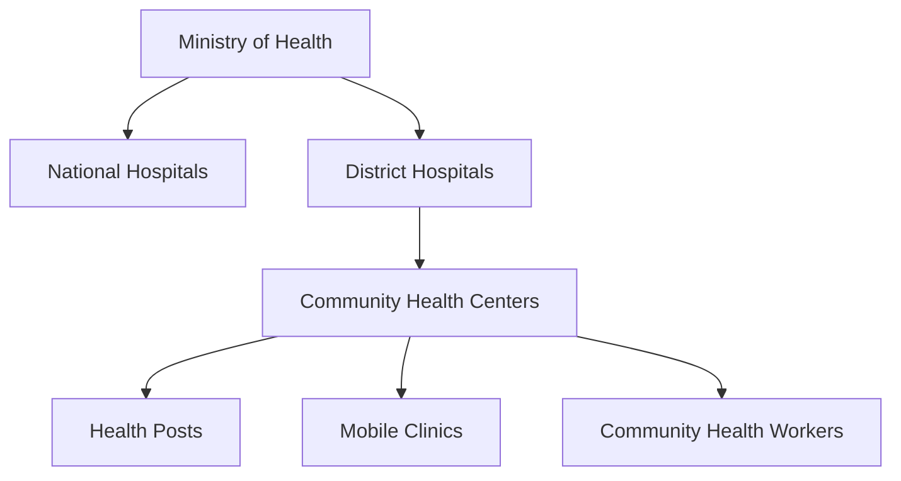

# ## Learning Unit 1

## Learning Unit 1: Introduction to First Aid and Emergency Response
- Objectives:
  * Define first aid and its importance in Timor-Leste
  * Understand the role of first responders in the Timorese healthcare system
- Topics:
  * Principles of first aid
  * Legal and ethical considerations in Timor-Leste
  * Overview of Timor-Leste's healthcare system and emergency services
- Activities:
  * Group discussion on local health challenges and emergency response needs
  * Role-play introducing oneself as a first aider in Tetum and Portuguese

## Unit Resources

# Lecture Notes

## Principles of First Aid

### Definition and Importance
- First aid is the immediate care given to a person who has been injured or suddenly taken ill, before professional medical help arrives.
- In Timor-Leste, first aid is crucial due to:
  - Limited access to healthcare facilities in rural areas
  - High rates of road accidents and natural disasters
  - Prevalence of tropical diseases and environmental hazards

### The "Three P's" of First Aid
1. Preserve life
   - Ensure scene safety
   - Check for responsiveness and breathing
   - Call for help
   - Perform CPR if necessary
2. Prevent further injury
   - Immobilize fractures
   - Control bleeding
   - Prevent shock
3. Promote recovery
   - Provide comfort and reassurance
   - Monitor vital signs
   - Protect from elements

### Adapting First Aid Principles to Timor-Leste's Context
- Use locally available materials for improvised first aid supplies
- Consider cultural sensitivities when providing care
- Integrate traditional healing practices when appropriate and safe
- Address language barriers in emergency communication

## Timor-Leste's Healthcare System

### Healthcare Structure
1. National level
   - Ministry of Health
   - National hospitals in Dili
2. District level
   - District hospitals
   - Community health centers
3. Community level
   - Health posts
   - Mobile clinics
   - Community health workers

### Role of First Responders
- Bridge gap between incident and professional medical care
- Provide immediate life-saving interventions
- Assist in triage during mass casualty events
- Educate communities on health and safety

### Challenges in Emergency Response
- Limited ambulance services
- Poor road infrastructure
- Shortage of trained medical professionals
- Lack of equipment and supplies in rural areas

## Legal and Ethical Considerations

### Good Samaritan Laws
- Timor-Leste's legal framework for protecting first aiders
- Duty to assist within one's capabilities
- Protection from liability when acting in good faith

### Consent and Confidentiality
- Obtaining consent before providing care
- Dealing with unconscious patients
- Maintaining patient privacy and confidentiality
- Special considerations for minors and vulnerable populations

### Cultural Sensitivity
- Respecting local customs and beliefs
- Gender considerations in providing care
- Integrating traditional healing practices when appropriate

# Discussion Questions

1. How does the limited healthcare infrastructure in Timor-Leste impact the importance of first aid skills among the general population?

2. What are some unique challenges that first responders might face in Timor-Leste compared to more developed countries?

3. How can traditional healing practices be respectfully integrated with modern first aid techniques in Timor-Leste?

4. Discuss the ethical dilemmas that might arise when providing first aid in a culturally diverse community like Timor-Leste.

5. What role can community education play in improving emergency response times and outcomes in Timor-Leste?

6. How might language barriers affect the provision of first aid in Timor-Leste, and what strategies can be employed to overcome these challenges?

7. Discuss the potential legal implications of providing first aid in Timor-Leste. How can first aiders protect themselves while still offering assistance?

8. What are some ways to improvise first aid supplies using locally available materials in Timor-Leste?

9. How can first aiders effectively communicate with patients and bystanders during an emergency situation in Timor-Leste?

10. Discuss the importance of psychological first aid in the context of Timor-Leste's recent history of conflict and natural disasters.

# Writing Exercise Instructions

## Exercise 1: First Aid Scenario Analysis

Write a 500-word analysis of a first aid scenario in Timor-Leste. Include the following elements:

1. Description of the emergency situation (e.g., road accident, natural disaster, sudden illness)
2. Assessment of the scene and potential hazards
3. Initial actions taken by the first aider
4. Challenges specific to the Timorese context (e.g., limited resources, cultural considerations)
5. How the "Three P's" of first aid were applied
6. Reflection on legal and ethical considerations
7. Suggestions for improving emergency response in similar situations

## Exercise 2: Comparative Healthcare Systems Essay

Write a 750-word essay comparing Timor-Leste's healthcare system with that of a neighboring country (e.g., Indonesia, Australia). Address the following points:

1. Structure of each healthcare system
2. Role of first responders and emergency services
3. Challenges faced in emergency response
4. Strengths and weaknesses of each system
5. Lessons that Timor-Leste could apply from the other country's system
6. Unique aspects of Timor-Leste's healthcare needs and how they are addressed
7. Recommendations for improving emergency care in Timor-Leste

# Assignment Details

## Research Project: Common Health Emergencies in Timor-Leste

1. Choose one common health emergency in Timor-Leste (e.g., malaria, dengue fever, road accidents, drowning)
2. Research the following aspects:
   - Prevalence and impact on the population
   - Current response protocols
   - Challenges in addressing the emergency
   - Role of first aid in improving outcomes
3. Write a 1000-word report including:
   - Introduction to the health emergency
   - Analysis of current situation and response
   - Discussion of how first aid can make a difference
   - Recommendations for improving emergency response
   - Conclusion summarizing key points
4. Include at least 5 credible sources, properly cited
5. Prepare a 5-minute presentation to share findings with the class

## Practical Assignment: First Aid Introduction Role-Play

1. Prepare a short script (1-2 minutes) introducing yourself as a first aider in both Tetum and Portuguese
2. Include the following elements:
   - Greeting and self-introduction
   - Explanation of your role as a first aider
   - Asking for consent to provide assistance
   - Brief assessment questions (e.g., "Are you in pain?", "Can you tell me what happened?")
   - Reassurance and explanation of what you're going to do
3. Practice the script with a partner or family member
4. Be prepared to perform the role-play in class next week
5. Write a short reflection (200 words) on the challenges of communicating in multiple languages during an emergency

# Additional Materials

## Key Vocabulary List

| English | Tetum | Portuguese |
|---------|-------|------------|
| First aid | Primeiru sokorru | Primeiros socorros |
| Emergency | Emerjénsia | Emergência |
| First responder | Primeiru respondedór | Primeiro socorrista |
| Healthcare system | Sistema saúde nian | Sistema de saúde |
| Ethics | Étika | Ética |
| Legal considerations | Konsiderasaun legál | Considerações legais |
| Consent | Konsentimentu | Consentimento |
| Confidentiality | Konfidensialidade | Confidencialidade |
| Triage | Triagem | Triagem |
| Vital signs | Sinál vitál sira | Sinais vitais |

## Diagram: Timor-Leste Healthcare System Structure

## Case Study: First Aid in a Remote Village

Maria, a trained first aider, is visiting her family in a remote village in Timor-Leste when a young boy falls from a tree and breaks his arm. The nearest hospital is several hours away, and there is no ambulance service available. Maria must use her first aid skills and locally available resources to stabilize the boy's injury and arrange for transportation to the hospital.

Discuss:
1. What immediate first aid should Maria provide?
2. How can she improvise a splint using local materials?
3. What cultural considerations should she be aware of when providing care?
4. How can she effectively communicate with the boy's family and arrange transportation?
5. What follow-up care instructions should she provide?