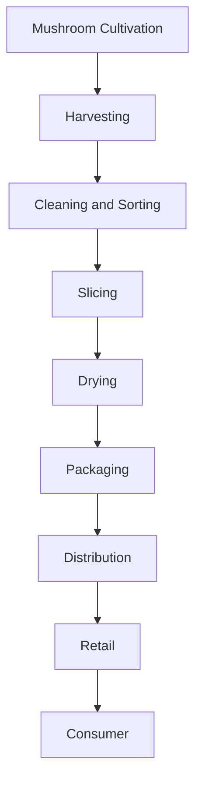
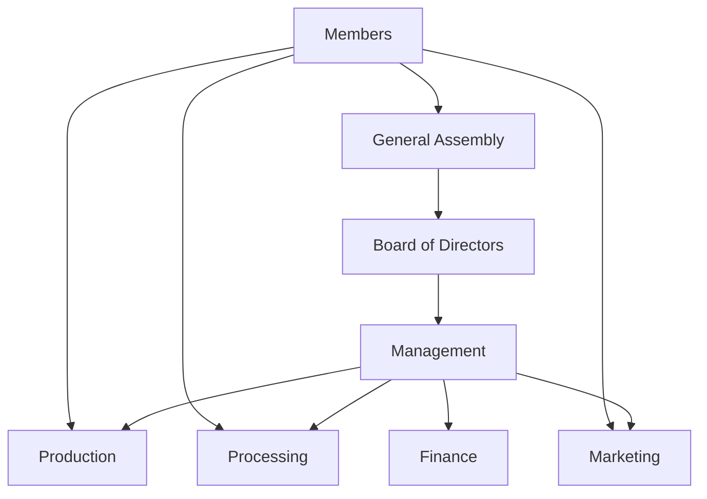

# ## Learning Unit 5

## Learning Unit 5: Economic Opportunities in Mushroom Cultivation
- Objectives:
  * Evaluate the market potential for mushrooms in Timor-Leste
  * Develop basic business plans for mushroom enterprises
- Topics:
  * Local and export markets for fresh and processed mushrooms
  * Value-added mushroom products (dried, powdered, extracts)
  * Cooperative models for small-scale producers
- Activities:
  * Market survey of mushroom demand in local communities
  * Draft a business plan for a mushroom cooperative

## Unit Resources

# Lecture Notes

## Local and Export Markets for Mushrooms

### Current Mushroom Market in Timor-Leste
- Limited commercial production, mostly small-scale and informal
- Main species cultivated: oyster mushrooms, shiitake
- Primarily sold in local markets and to restaurants in Dili
- Growing interest from health-conscious consumers and expatriates

### Potential Export Markets in Southeast Asia
- Singapore: High-end restaurants, health food stores
- Indonesia: Growing middle class, increasing health awareness
- Malaysia: Established mushroom market, opportunity for specialty varieties
- Key challenges: Meeting quality standards, consistent supply, export regulations

### Demand Trends for Fresh and Processed Mushrooms
- Fresh mushrooms: Increasing demand in urban areas, hotels, and restaurants
- Dried mushrooms: Growing market for convenience foods and soups
- Mushroom powders: Rising popularity in health supplements and functional foods
- Mushroom extracts: Emerging market in nutraceuticals and traditional medicine

## Value-Added Mushroom Products

### Types of Processed Mushroom Products
1. Dried mushrooms
   - Whole dried mushrooms
   - Sliced dried mushrooms
2. Powdered mushrooms
   - Pure mushroom powders
   - Mushroom coffee blends
   - Mushroom tea mixes
3. Mushroom extracts
   - Liquid extracts (tinctures)
   - Capsules and tablets

### Benefits of Value-Added Products
- Extended shelf life: Reduces waste, allows for broader distribution
- Higher profit margins: Increased value per unit of raw material
- Market differentiation: Unique products can command premium prices
- Seasonal stability: Processed products can be sold year-round

### Case Studies of Successful Value-Added Mushroom Businesses
1. Four Sigmatic (Finland/USA)
   - Mushroom coffee and elixir products
   - Global success through e-commerce and health food stores
2. Mycological (Australia)
   - Gourmet dried mushroom blends
   - Focus on native Australian species
3. Hokto Kinoko (Japan)
   - Fresh and processed specialty mushrooms
   - Successful expansion into international markets

## Cooperative Models for Small-Scale Producers

### Benefits of Cooperatives
- Shared resources: Equipment, storage facilities, transportation
- Increased bargaining power: Better prices for inputs and outputs
- Knowledge sharing: Collective learning and problem-solving
- Access to finance: Improved creditworthiness as a group
- Marketing advantages: Pooled resources for branding and promotion

### Structure and Organization of Agricultural Cooperatives
- Membership: Open to all producers meeting specific criteria
- Democratic control: One member, one vote
- Economic participation: Members contribute equitably to capital
- Autonomy and independence: Controlled by members
- Education and training: Ongoing development for members
- Cooperation among cooperatives: Networking and partnerships

### Examples of Successful Mushroom Cooperatives
1. Soppas Cooperative (Italy)
   - Focus on wild mushroom foraging and processing
   - Successful export business to high-end restaurants
2. Mushroom Growers Association of Ghana
   - Training and support for small-scale growers
   - Collective marketing and quality control

# Discussion Questions

1. What are the main challenges facing mushroom producers in Timor-Leste when trying to access export markets?
2. How can value-added mushroom products help small-scale producers increase their income?
3. What are the potential benefits and drawbacks of forming a mushroom growers' cooperative in your local area?
4. How might cultural attitudes towards mushrooms in Timor-Leste affect marketing strategies for new mushroom products?
5. What role could government support play in developing the mushroom industry in Timor-Leste?
6. How can mushroom cultivation contribute to food security and nutrition in rural communities?
7. What are some innovative ways to promote mushroom consumption among Timorese consumers?
8. How might climate change impact the mushroom industry in Timor-Leste, and how can producers adapt?

# Writing Exercise Instructions

## Business Plan Executive Summary

Write a one-page executive summary for a mushroom cultivation business in Timor-Leste. Include the following elements:

1. Business concept: Briefly describe your mushroom cultivation idea.
2. Products and services: What specific mushroom products will you offer?
3. Target market: Who are your potential customers?
4. Competitive advantage: What makes your business unique?
5. Financial projections: Provide a basic overview of expected costs and revenues.
6. Sustainability aspect: How does your business contribute to sustainable development?

Format your executive summary professionally, using clear headings and concise language. Be prepared to present your summary to the class for feedback.

# Assignment Details

## Market Survey Project

Conduct a small-scale market survey in your local community to assess the demand for mushroom products. Follow these steps:

1. Develop a short questionnaire (5-10 questions) covering:
   - Current mushroom consumption habits
   - Interest in new mushroom products
   - Willingness to pay for different mushroom products
   - Preferred purchasing locations

2. Survey at least 20 individuals from diverse backgrounds (age, gender, occupation).

3. Compile and analyze the results, looking for patterns and insights.

4. Prepare a one-page report summarizing your findings, including:
   - Key demographics of survey participants
   - Most popular mushroom products
   - Price points for different products
   - Potential marketing strategies based on preferences

5. Include a brief reflection on how this market information could inform a mushroom business plan.

Submit your report and completed survey forms by the next class session.

# Additional Materials

## Sample Value Chain Map for Dried Mushroom Product

## Cooperative Structure Diagram

## Mushroom Product Price Comparison Table

| Product Type | Average Price (USD/kg) | Profit Margin (%) |
|--------------|------------------------|-------------------|
| Fresh Mushrooms | $5-8 | 30-40% |
| Dried Mushrooms | $30-50 | 50-60% |
| Mushroom Powder | $80-120 | 60-70% |
| Mushroom Extract | $150-200 | 70-80% |

Note: Prices and margins are estimates and may vary based on specific products and market conditions.