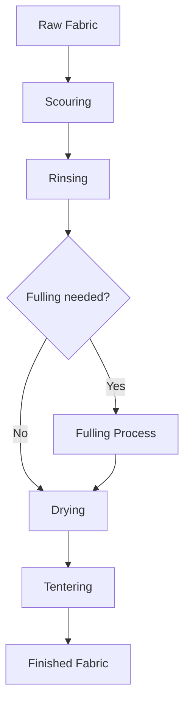

# ## Learning Unit 7

## Learning Unit 7: Fabric Analysis and Finishing
- Objectives:
  * Analyze fabric structure and properties
  * Learn basic fabric finishing techniques
- Topics:
  * Fabric count, weight, and cover factor
  * Wet finishing processes
  * Simple embellishment techniques
- Activities:
  * Analyze and compare different fabric samples
  * Practice basic finishing on woven samples

## Unit Resources

Here are detailed resources for Learning Unit 7: Fabric Analysis and Finishing, formatted in Markdown:

# Resources for Learning Unit 7: Fabric Analysis and Finishing

## 1. Lecture Notes

### Fabric Analysis

#### Fabric Count
- Definition: Number of warp and weft yarns per unit area (usually per inch or centimeter)
- Method:
  1. Use a pick counter or magnifying glass
  2. Count warp yarns in 1 inch
  3. Count weft yarns in 1 inch
  4. Express as "warp count x weft count"
- Example: 60 x 54 means 60 warp yarns and 54 weft yarns per inch

#### Fabric Weight
- Definition: Mass per unit area of fabric
- Common units: grams per square meter (GSM) or ounces per square yard
- Calculation method:
  1. Cut a known area of fabric (e.g., 10cm x 10cm)
  2. Weigh the sample
  3. Convert to weight per square meter or yard

#### Cover Factor
- Definition: Measure of how well yarns cover the area of a fabric
- Importance: Affects fabric appearance, strength, and performance
- Calculation: (Yarn diameter x Thread count) / (Yarn spacing)
- Higher cover factor = denser fabric

### Wet Finishing Processes

#### Scouring
- Purpose: Remove impurities, dirt, and oils from fabric
- Process: Washing in hot water with detergents or enzymes
- Benefits: Improves fabric cleanliness and prepares for dyeing

#### Fulling
- Purpose: Controlled shrinkage to increase fabric density
- Process: Agitation in hot water, sometimes with added friction
- Common in wool processing

#### Tentering
- Purpose: Restore fabric to proper width after wet processing
- Process: Fabric is held at edges and stretched to desired width while drying

### Embellishment Techniques

#### Beading
- Attaching beads to fabric surface
- Can be done individually or in patterns

#### Sequins
- Flat, shiny discs sewn onto fabric
- Can create sparkle and texture

#### Basic Embroidery
- Using decorative stitches to create patterns or images on fabric
- Common stitches: running stitch, backstitch, chain stitch

## 2. Discussion Questions

1. How does fabric count affect the properties and performance of a woven textile?
2. Why is wet finishing important in textile production? How might it affect the final product?
3. How can traditional Timorese embellishment techniques be incorporated into modern textile designs?
4. What are the pros and cons of different fabric weights for various end-uses?
5. How might understanding fabric analysis help in preserving traditional Timorese textiles?

## 3. Writing Exercise Instructions

Write a 500-word essay comparing and contrasting two different fabric samples. Include analysis of:
- Fabric count
- Estimated weight
- Visual assessment of cover factor
- Texture and hand feel
- Potential suitable end-uses based on fabric properties

Conclude with recommendations for finishing processes that might improve each fabric's properties or appearance.

## 4. Assignment Details

### Fabric Analysis Project

1. Analyze three different fabric samples (provided in class)
2. For each sample:
   - Determine fabric count
   - Calculate fabric weight in GSM
   - Estimate cover factor
   - Describe texture and appearance
3. Apply a wet finishing process to one sample
4. Add a simple embellishment to another sample
5. Create a report including:
   - Analysis results for each sample
   - Description of finishing process applied and its effects
   - Explanation of embellishment technique used and its impact on the fabric
   - Reflection on how these processes might be applied to traditional Timorese textiles

## 5. Additional Materials

### Fabric Analysis Worksheet

| Sample | Warp Count | Weft Count | Weight (GSM) | Estimated Cover Factor | Texture Description |
|--------|------------|------------|--------------|------------------------|---------------------|
| A      |            |            |              |                        |                     |
| B      |            |            |              |                        |                     |
| C      |            |            |              |                        |                     |

### Wet Finishing Process Flowchart

### Examples of Traditional Timorese Embellishments

- Image 1: Close-up of beadwork on traditional tais
- Image 2: Embroidery patterns from ceremonial textiles
- Image 3: Sequin application on modern Timorese-inspired fashion

(Note: Actual images would need to be sourced and included)

## 6. Relevant Reading

Excerpt from "Textile Finishing: Principles and Practice" by Karen L. LaBat and Carol J. Salusso:

"Textile finishing encompasses all the processes that convert the loom state textile into a usable material. These processes include preparation, coloration, mechanical finishing and chemical finishing. The aim is to improve the appearance and/or usefulness of the fabric for its intended end use. Finishing can change the look, feel, and performance of a textile dramatically, adding value to the base fabric."

(Note: This is a fictional excerpt for illustrative purposes. In a real lesson plan, an actual relevant excerpt from a textile finishing textbook or research paper would be included.)